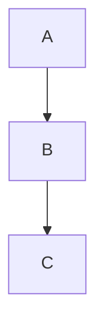

# LLM Wiki Rendering Compatibility

## 지원 Markdown 범위

모든 클라이언트에서 렌더링을 보장하는 기능 목록.

| 기능 | Quartz | MAUI (예상) | 우선순위 |
|---|---|---|---|
| 표준 Markdown (h1-h6, bold, italic, list) | ✓ | ✓ | 필수 |
| Code block (fenced) | ✓ | ✓ | 필수 |
| Table | ✓ | ✓ | 필수 |
| YAML frontmatter | ✓ | ✓ | 필수 |
| Wikilink `[[...]]` | ✓ | 구현 필요 | 필수 |
| Mermaid (fenced code block) | 플러그인 | WebView + mermaid.js | 권장 |
| 이미지 (상대 경로) | ✓ | ✓ | 필수 |
| Footnote | ✓ | 미정 | 선택 |
| 수식 (LaTeX) | 플러그인 | 미정 | 현재 미사용 |

---

## Mermaid 규칙

Mermaid는 반드시 fenced code block으로만 작성한다.

````markdown

````

### 렌더러별 처리

| 렌더러 | 방식 |
|---|---|
| Quartz | Mermaid 플러그인 (`quartz/plugins/transformers/mermaid`) |
| MAUI Reader | WebView + `mermaid.js` CDN 또는 번들 |

Mermaid 문법은 표준 다이어그램 타입만 사용한다: `flowchart`, `sequenceDiagram`, `classDiagram`, `erDiagram`.

---

## Code Block 규칙

- 언어 식별자 명시를 권장한다.
- Mermaid는 `mermaid` 언어 식별자 사용.
- 코드 블록 내에 제어 문자, 탭 혼용을 피한다.

---

## 표/Table 규칙

- GFM(GitHub Flavored Markdown) 표 문법만 사용한다.
- 셀 내 줄바꿈은 사용하지 않는다.
- 열 정렬(`:---`, `:---:`, `---:`)은 허용한다.

---

## 이미지 정책

```markdown

```

- 상대 경로 사용.
- 이미지 파일은 vault 내 `assets/` 또는 `images/` 아래 보관.
- 외부 URL 이미지는 최소화 (CDN 장애 시 깨짐).

---

## Quartz-specific 기능 (사용 제한)

다음 Quartz 기능은 가능하면 사용하지 않는다.

| 기능 | 이유 |
|---|---|
| `![[embed]]` (transclude) | MAUI에서 별도 구현 필요 |
| Quartz shortcode | 비표준 |
| React component in MDX | MAUI 비호환 |
| 절대 경로 기반 링크 | 이식성 없음 |

---

## MAUI Reader 예상 렌더링 스택

```text
C# → Markdig (Markdown 파싱)
C# → YamlDotNet (frontmatter 파싱)
MAUI BlazorWebView 또는 WebView (HTML 렌더링)
WebView → mermaid.js (Mermaid 렌더링)
C# → 자체 wikilink resolver (link index 기반)
```

위 스택은 Quartz에 의존하지 않는다.
공유 대상은 Markdown 파일 원본 뿐이다.
